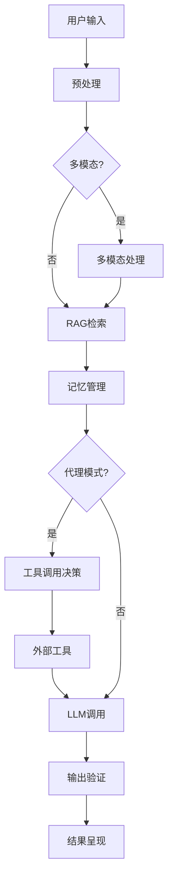

# 智能语言模型应用框架

## 项目概述

本项目是一个功能强大的大语言模型应用框架，集成了多种先进AI技术，包括多模态处理、RAG知识增强、工具调用和智能代理系统。框架提供了命令行界面和API接口，支持灵活配置和扩展，适用于各种AI应用场景。

## 项目结构
```text
ai-project/
├── assets/                  # 资源文件
├── config/
│   └── schema.json          # JSON Schema定义
├── modules/                 # 核心模块
│   ├── agent_extension.py   # 智能代理
│   ├── agent_wrapper.py     # 代理包装器
│   ├── compare.py           # 参数对比
│   ├── interface.py         # CLI界面
│   ├── llm_client.py        # LLM客户端
│   ├── memory_manager.py    # 记忆管理
│   ├── multimodal.py        # 多模态处理
│   ├── preprocessing.py     # 输入预处理
│   ├── rag.py               # RAG检索
│   ├── tool_integration.py  # 工具集成
│   ├── utils.py             # 工具函数
│   └── validator.py         # JSON验证
├── scripts/
│   └── batch_test.py        # 批量测试
├── test_data/               # 测试数据
│   ├── sample_inputs.json   # 测试样本
│   └── sensitive_words.txt  # 敏感词表
├── main.py                  # 主入口
├── env.py                   # 环境管理
├── requirements.txt         # 依赖列表
└── README.md                # 项目文档
```

## 功能亮点

- **多模型支持**：集成GPT-3.5/4、DeepSeek、Qwen等主流大模型
- **多模态处理**：支持图像描述生成、语音转文字
- **知识增强**：基于FAISS的RAG检索增强生成
- **工具集成**：计算器、数据库、API、Python解释器等工具无缝调用
- **智能代理**：自主决策工具使用的工作流
- **结构化输出**：JSON Schema规范输出格式
- **记忆管理**：对话历史和用户画像支持

## 安装指南

```bash
# 克隆项目
git clone https://github.com/Shu-Feather/LLM-Application-Dev..git
cd LLM-Application-Dev.

# 创建虚拟环境
python -m venv ai_env
source ai_env/bin/activate  # Linux/macOS
ai_env\Scripts\activate    # Windows

# 安装依赖
pip install -r requirements.txt

# 设置API密钥
echo "OPENAI_API_KEY=your_api_key_here" > .env
```

## 系统架构


## 使用指南
### 基础功能层
1. 参数对比
    ```bash 
    # 对比不同参数对输出的影响
    python -c "from modules.compare import compare_params; compare_params('地壳中含量最高的五种元素是什么？')"
    ```
2. 基础交互界面(CLI)
    ```bash 
    # 启动命令行界面
    python main.py --model gpt-4 --temp 0.7
    ```
3. 真实场景测试数据
   ```bash 
    # 运行批量测试
    python scripts/batch_test.py
    ```
4. 结构化输出控制
   ```bash 
    # 查看输出Schema
    cat config/schema.json
    ```
### 进阶功能层
1. 多模态扩展
   ```bash 
    # 图像描述生成
    python main.py --enable_multimodal --image_input assets/pic_1.png --model gpt-4o

    # 音频转文字
    python main.py --enable_multimodal --audio_input assets/audio.mp3
    ```
2. RAG知识库增强
    ```bash 
    # 构建RAG索引
    python -c "from modules.rag import RAGRetriever; retriever = RAGRetriever(); retriever.build_index([{'text':'示例文档1'}, {'text':'示例文档2'}])"

    # 使用RAG增强
    python main.py --enable_rag --rag_docs path/to/knowledge.json
    ```
3. 记忆机制
   ```bash 
    # 启用记忆功能
    python main.py --enable_memory

    # 查看对话历史
    sqlite3 memory.db "SELECT * FROM conversations"
    ```
4. 外部工具集成
   ```bash 
    # 测试计算器工具
    python -c "from modules.tool_integration import CalculatorTool; print(CalculatorTool().calculate('2的10次方加上5乘以3'))"

    # 执行SQL查询
    python -c "from modules.tool_integration import DatabaseTool; print(DatabaseTool().execute('SELECT * FROM users'))"

    # 调用API
    python -c "from modules.tool_integration import APITool; print(APITool().call('GET', 'https://api.example.com/data'))"
    ```
5. 自主Agent实现
   ```bash 
    # 启动Agent模式
    python main.py --use_advanced_agent

    # Agent示例命令:
    # 2+2
    # 查询用户表中年龄大于30的记录
    # 获取https://github.com的信息
    # 图像描述: "描述assets/pic_1.png的内容"
    ```
---
## 配置选项
| 参数 | 描述 | 默认值 |
|------|------|--------|
| `--model` | 指定LLM模型 (`gpt-4`, `gpt-3.5-turbo`, `gpt-4o`, `qwen`, `deepseek` 等) | `gpt-4` |
| `--temp` | 温度参数 (控制输出的随机性，0.0-2.0) | `0.7` |
| `--top_p` | Top-p采样参数 (控制输出多样性，0.0-1.0) | `1.0` |
| `--enable_multimodal` | 启用多模态处理 (支持图像和音频输入) | `false` |
| `--image_input` | 图像文件路径 (支持 .jpg, .png 格式) | `None` |
| `--audio_input` | 音频文件路径 (支持 .mp3, .wav 格式) | `None` |
| `--enable_rag` | 启用RAG检索增强生成 | `false` |
| `--rag_index` | RAG索引路径 (`.index` 和 `.docs.json` 文件前缀) | `None` |
| `--rag_docs` | RAG文档路径 (JSON格式的知识库文件) | `None` |
| `--enable_memory` | 启用对话记忆功能 | `false` |
| `--use_advanced_agent` | 使用高级Agent模式 (集成工具调用) | `false` |
| `--medical` | 启用医疗报告生成模式 | `false` |
| `--visualize` | 启用数据可视化模式 | `false` |
| `--max_tokens` | 最大输出token数 | `2048` |
| `--presence_penalty` | 存在惩罚 (-2.0 到 2.0) | `0.0` |
| `--frequency_penalty` | 频率惩罚 (-2.0 到 2.0) | `0.0` |
| `--log_level` | 日志级别 (`DEBUG`, `INFO`, `WARNING`, `ERROR`) | `INFO` |

---
如有任何问题，请联系:
- 邮箱: airfeathering@gmail.com
- GitHub Issues: https://github.com/Shu-Feather/LLM-Application-Dev./issues
